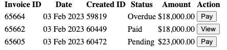
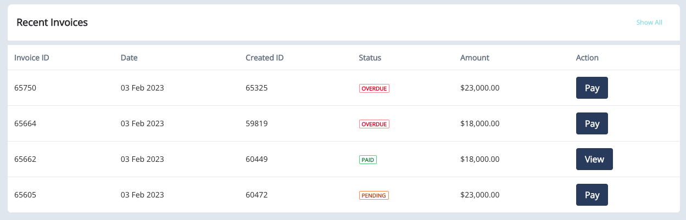
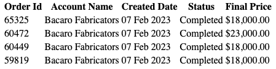
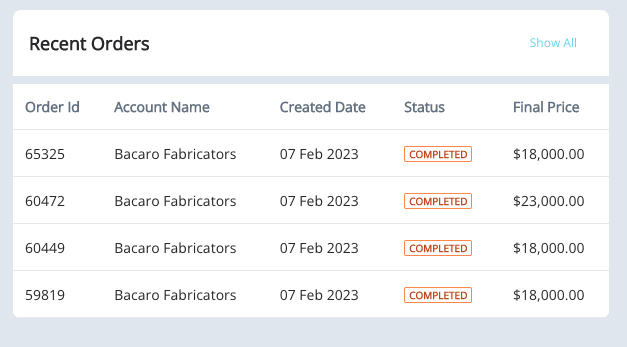
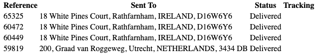
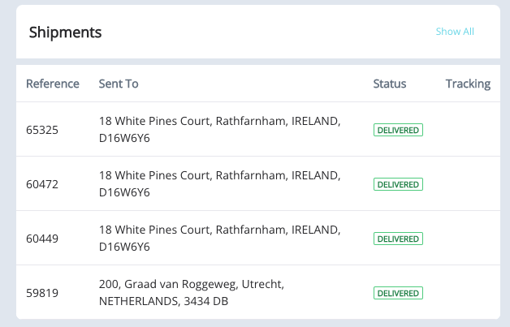

# Commerce Dashboard Components

## Getting Started
The original getting started guide can be found [here](./getting-started.md)

## Overview

The following components all do things slightly differently to showcase the different approaches which could be taken.

## Fragments

In order to render these components you need the fragment collection. The latest version can be found [here](https://github.com/peterrichards-lr/commerce-dashboard-remote-apps/releases/latest/)

### Recent Invoices

Uses Liferay Object to source the data

### Recewnt Orders

Uses fragment to pass the commerce context so the Commerce headless delivery API can be used to source the data. The commerce context is passed as parameters to the custom element.

### Recent Shipments

Uses fragment to pass the commerce context so the Commerce headless delivery API can be used to source the data. The commerce context is passed as sibling config element.

